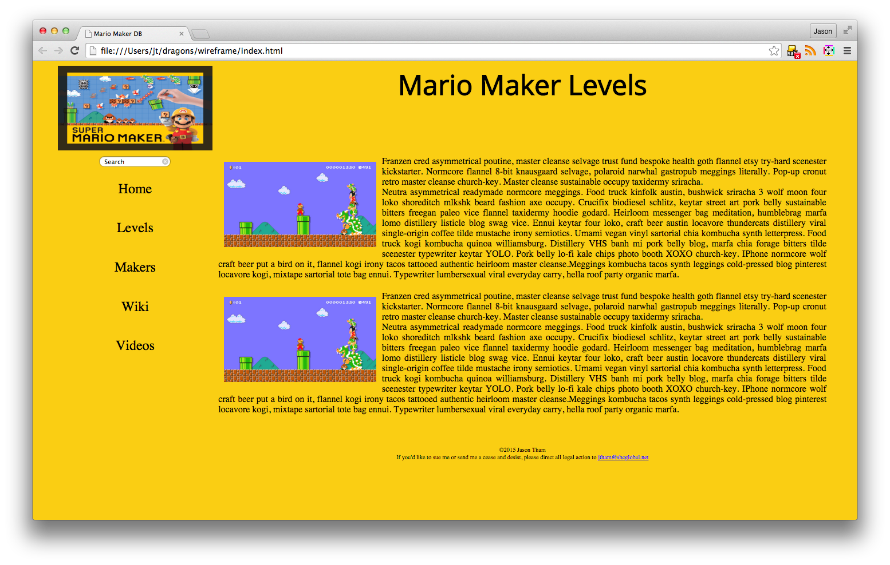

# Mario Maker Database

This is a website meant to provide a platform to collect, review, and share Mario Maker levels.

#### UI Constructors
I made two UI component constructors, one for the search bar on the left and one for all the text boxes in the content class.  The search bar constructor creates:

1. a searchbox object which has a domElement set to the first input element
2. a listener event for the search box
3. a render function which takes a value and sets the text inside the search box to that value.

The text box constructor creates:

1. a textbox object object which has an array of domElements which contain every tag on the page of class 'content' so we are able to modify all text
2. a render method which loops through the array of all elements with class name content and then calls the string replace method on all text inside these elements to add some CSS that makes the text appear highlighted in purple.

